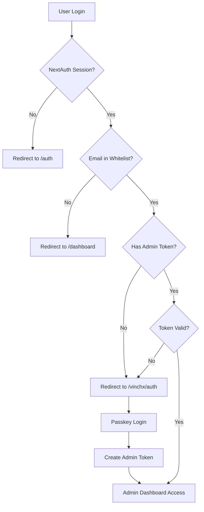

# 🔐 Admin System Documentation

## Overview

ChitChat V5 menggunakan **3-layer security system** untuk admin panel yang aman dan modern.

---

## 🏗️ Architecture

### Security Layers



### Layer Breakdown

1. **Layer 1: User Authentication (NextAuth)**
   - User harus login terlebih dahulu dengan akun normal
   - Menggunakan NextAuth session management

2. **Layer 2: Admin Whitelist**
   - Email user harus terdaftar di environment variable `ADMIN_EMAILS`
   - Dikelola melalui `.env.local` (tidak masuk git)

3. **Layer 3: Passkey Authentication + Admin Token**
   - Admin login dengan WebAuthn (passkey/biometric)
   - Setelah berhasil, sistem generate admin token
   - Token berlaku selama **8 jam**
   - Disimpan di localStorage dengan encryption check

---

## 📁 File Structure

```
src/
├── lib/
│   ├── admin-config.js         # WebAuthn config & admin whitelist checker
│   ├── admin-session.js        # Admin token management
│   └── webauthn.js             # WebAuthn passkey functions
│
├── hooks/
│   └── useAdminAuth.js         # React hook untuk admin auth check
│
├── app/
│   ├── vinchx/
│   │   ├── auth/
│   │   │   └── page.jsx        # Admin login page (passkey)
│   │   └── dashboard/
│   │       ├── page.jsx        # Main admin dashboard
│   │       └── passkeys/
│   │           └── page.jsx    # Passkey management page
│   │
│   └── api/admin/
│       ├── auth/
│       │   └── token/
│       │       └── route.js    # Generate admin token
│       ├── passkey/
│       │   ├── register/
│       │   ├── verify-registration/
│       │   ├── authenticate/
│       │   ├── verify-authentication/
│       │   └── list/
│       ├── stats/              # Admin statistics
│       └── debug-user/         # User debugging tools
```

---

## ⚙️ Configuration

### Environment Variables

Edit `.env.local` (file ini **TIDAK** di-commit ke git):

```bash
# Admin Configuration
# Comma-separated list of admin emails (no spaces)
ADMIN_EMAILS=admin1@example.com,admin2@example.com,admin3@example.com

# WebAuthn / Passkey Domain Configuration
# For localhost: use "localhost"
# For ngrok: use domain without https:// (e.g., your-url.ngrok-free.dev)
NEXT_PUBLIC_DOMAIN=localhost

# Server URLs (must match NEXT_PUBLIC_DOMAIN)
NEXT_PUBLIC_SERVER_URL=http://localhost:1630
NEXTAUTH_URL=http://localhost:1630
```

### Adding New Admin

1. Open `.env.local`
2. Add email to `ADMIN_EMAILS` (comma-separated, no spaces):
   ```bash
   ADMIN_EMAILS=existing@email.com,newemail@example.com
   ```
3. Restart dev server
4. New admin can now access `/vinchx/auth`

### Removing Admin

1. Open `.env.local`
2. Remove email from `ADMIN_EMAILS`
3. Restart dev server

---

## 🚀 Admin Login Flow

### Step-by-Step Process

1. **User Normal Login**

   ```
   User → /auth → Login with credentials → Session created
   ```

2. **Admin Check**

   ```
   If email in ADMIN_EMAILS → Redirect to /vinchx/auth
   Else → Redirect to /dashboard (normal user)
   ```

3. **Passkey Authentication**

   ```
   /vinchx/auth → Click "Login with Passkey" → Biometric prompt
   → Passkey verified → Admin token created (8 hour expiry)
   → localStorage.setItem('admin_token', {...})
   → Redirect to /vinchx/dashboard
   ```

4. **Access Admin Dashboard**
   ```
   /vinchx/dashboard → Check all 3 layers → Grant access
   ```

---

## 🔑 Passkey Management

### What is a Passkey?

- **WebAuthn standard** untuk passwordless authentication
- Menggunakan **biometric** (fingerprint, face ID) atau **PIN**
- Lebih aman dari password karena:
  - Tidak bisa di-phishing
  - Tidak bisa dicuri (stored di device)
  - Unique per website

### Registering a New Passkey

1. Login sebagai admin → `/vinchx/dashboard/passkeys`
2. Click **"Register New Passkey"**
3. Choose authenticator:
   - **This device** (laptop/PC fingerprint/PIN)
   - **Phone/Tablet** (scan QR code)
   - **Security key** (YubiKey, etc.)
4. Follow browser prompt
5. Passkey saved & listed

### Using Multiple Devices

You can register multiple passkeys:

- Laptop fingerprint
- Phone biometric
- Security key backup

Each device gets its own passkey credential.

### Deleting a Passkey

1. Go to `/vinchx/dashboard/passkeys`
2. Find the passkey in list
3. Click **Delete** button
4. Confirm deletion

> ⚠️ **Warning**: Don't delete all passkeys or you'll be locked out!  
> Always keep at least 1 active passkey.

---

## 🛡️ Security Features

### Admin Token

- **Duration**: 8 hours
- **Storage**: localStorage (client-side)
- **Format**:
  ```json
  {
    "email": "admin@example.com",
    "issuedAt": "2026-01-25T10:00:00.000Z",
    "expiresAt": "2026-01-25T18:00:00.000Z"
  }
  ```

### Token Validation

The system validates:

1. Token exists in localStorage
2. Token not expired (< expiresAt)
3. Email matches current session user

### Automatic Logout

Admin token expires after 8 hours:

- User redirected to `/vinchx/auth`
- Must re-authenticate with passkey
- New token generated

---

## 🔒 Best Practices

### Security Recommendations

1. **Never commit `.env.local`**
   - Already in `.gitignore`
   - Contains sensitive admin emails

2. **Use production MongoDB for admin**
   - Don't use local MongoDB in production
   - Use MongoDB Atlas with proper access control

3. **Register backup passkeys**
   - At least 2 passkeys per admin
   - Store security key in safe place

4. **Review admin list regularly**
   - Remove ex-team members
   - Audit admin access logs

5. **Use ngrok only for development**
   - For production, use proper domain with SSL
   - Update `NEXT_PUBLIC_DOMAIN` accordingly

### For Production Deployment

```bash
# .env.production
ADMIN_EMAILS=admin@company.com,backup-admin@company.com
NEXT_PUBLIC_DOMAIN=chitchat.yourcompany.com
NEXT_PUBLIC_SERVER_URL=https://chitchat.yourcompany.com
NEXTAUTH_URL=https://chitchat.yourcompany.com
```

---

## 🐛 Troubleshooting

### Error: "RP ID is invalid for this domain"

**Cause**: `NEXT_PUBLIC_DOMAIN` doesn't match your access URL

**Solution**:

```bash
# For localhost
NEXT_PUBLIC_DOMAIN=localhost
NEXT_PUBLIC_SERVER_URL=http://localhost:1630

# For ngrok
NEXT_PUBLIC_DOMAIN=your-url.ngrok-free.dev
NEXT_PUBLIC_SERVER_URL=https://your-url.ngrok-free.dev
```

Then restart server: `npm run dev:fast`

### Error: "Forbidden - Admin access required"

**Cause**: Your email is not in `ADMIN_EMAILS`

**Solution**:

1. Check `.env.local`
2. Add your email to `ADMIN_EMAILS`
3. Restart server

### Locked Out (No Passkeys)

**Solution**:

1. Database access required
2. Connect to MongoDB
3. Find admin user in `users` collection
4. Clear `passkeys` array:
   ```js
   db.users.updateOne(
     { email: "admin@example.com" },
     { $set: { passkeys: [] } },
   );
   ```
5. Re-register new passkey

### Admin Token Expired

**Solution**:

- Simply login again at `/vinchx/auth`
- New token will be generated

---

## 🆘 Emergency Access

### If You're Completely Locked Out

1. **Check environment variables**

   ```bash
   cat .env.local | grep ADMIN_EMAILS
   ```

2. **Verify MongoDB connection**

   ```bash
   mongo mongodb://localhost:27017/chitchat
   db.users.find({ email: "your@email.com" })
   ```

3. **Reset admin data**

   ```js
   // In MongoDB shell
   db.users.updateOne(
     { email: "admin@example.com" },
     {
       $set: {
         passkeys: [],
         role: "admin", // optional
       },
     },
   );
   ```

4. **Clear browser data**
   - Clear localStorage
   - Clear cookies
   - Refresh page

---

## 📊 Admin Dashboard Features

### Current Features

- **Statistics Overview**
  - Total users
  - Total messages
  - Active chats
  - System health

- **Passkey Management**
  - List all registered passkeys
  - Register new passkey
  - Delete passkey
  - View last used date

- **User Debugging** (via API)
  - View user details
  - Check user session
  - Inspect user data

### Creating New Admin Features

To add new protected admin pages:

```jsx
// src/app/vinchx/dashboard/your-feature/page.jsx
"use client";

import { useAdminAuth } from "@/hooks/useAdminAuth";

export default function YourAdminFeature() {
  const { isAdminAuthed, isLoading } = useAdminAuth();

  if (isLoading) {
    return <div>Loading...</div>;
  }

  if (!isAdminAuthed) {
    return null; // useAdminAuth will redirect
  }

  return (
    <div>
      <h1>Your Protected Admin Feature</h1>
      {/* Your admin UI here */}
    </div>
  );
}
```

---

## 📚 Technical References

### WebAuthn Resources

- [WebAuthn Guide](https://webauthn.guide/)
- [SimpleWebAuthn Docs](https://simplewebauthn.dev/)
- [MDN WebAuthn API](https://developer.mozilla.org/en-US/docs/Web/API/Web_Authentication_API)

### Related Files

- **User Model**: `src/models/User.js` (contains passkeys schema)
- **Auth Config**: `src/auth.js` (NextAuth configuration)
- **Cookie Utils**: `src/lib/cookie-utils.js` (for clearing sessions)

---

## 📝 Change Log

### v5.1 - Secure Admin System

- ✅ Moved admin emails to environment variables
- ✅ Added `NEXT_PUBLIC_DOMAIN` for WebAuthn
- ✅ Improved security with 3-layer authentication
- ✅ Added comprehensive documentation

---

## 🤝 Support

Jika ada pertanyaan atau masalah:

1. Check troubleshooting section di atas
2. Review console logs untuk error details
3. Check browser DevTools → Application → localStorage
4. Verify `.env.local` configuration

---

**Last Updated**: January 25, 2026  
**Maintained by**: ChitChat Development Team
