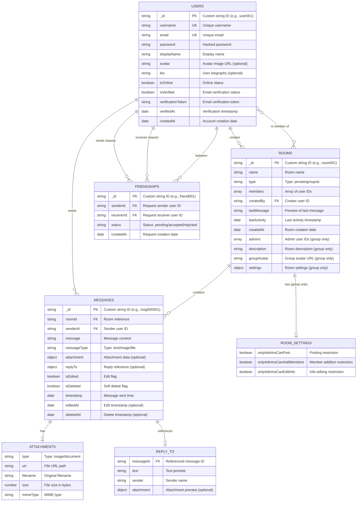

# Entity Relationship Diagram (ERD) - ChitChat V5.1 AI

## Overview
ChitChat V5.1 adalah aplikasi chat real-time dengan integrasi AI yang menggunakan MongoDB sebagai database. Berikut adalah ERD yang menggambarkan relasi antar entitas dalam aplikasi ini.

---

## ERD Diagram



---

## Entity Descriptions

### 1. USERS (Collection: `users`)
Menyimpan data pengguna aplikasi.

| Field | Type | Description |
|-------|------|-------------|
| `_id` | String | Primary key, custom ID (e.g., "user001") |
| `username` | String | Username unik untuk login |
| `email` | String | Email unik untuk login dan verifikasi |
| `password` | String | Password yang di-hash |
| `displayName` | String | Nama tampilan |
| `avatar` | String | URL foto profil (opsional) |
| `bio` | String | Bio singkat (opsional) |
| `isOnline` | Boolean | Status online/offline |
| `isVerified` | Boolean | Status verifikasi email |
| `verificationToken` | String | Token untuk verifikasi email |
| `verifiedAt` | Date | Waktu verifikasi berhasil |
| `createdAt` | Date | Waktu pembuatan akun |

---

### 2. ROOMS (Collection: `rooms`)
Menyimpan data room/chat.

| Field | Type | Description |
|-------|------|-------------|
| `_id` | String | Primary key, custom ID (e.g., "room001") |
| `name` | String | Nama room |
| `type` | String | Jenis room: "private", "group", atau "ai" |
| `members` | Array[String] | Daftar user ID yang menjadi anggota |
| `createdBy` | String | User ID pembuat room |
| `lastMessage` | String | Preview pesan terakhir (50 karakter) |
| `lastActivity` | Date | Waktu aktivitas terakhir |
| `createdAt` | Date | Waktu pembuatan room |
| `admins` | Array[String] | Daftar admin (khusus group) |
| `description` | String | Deskripsi room (khusus group) |
| `groupAvatar` | String | URL avatar group (khusus group) |
| `settings` | Object | Pengaturan room (khusus group) |

**Room Types:**
- **private**: Chat 1-on-1 antara 2 user yang sudah berteman
- **group**: Chat grup dengan banyak anggota
- **ai**: Chat dengan AI Assistant

---

### 3. MESSAGES (Collection: `messages`)
Menyimpan pesan-pesan dalam room.

| Field | Type | Description |
|-------|------|-------------|
| `_id` | String | Primary key, custom ID (e.g., "msg000001") |
| `roomId` | String | Foreign key ke rooms._id |
| `senderId` | String | Foreign key ke users._id atau "ai-assistant" |
| `message` | String | Isi pesan |
| `messageType` | String | Tipe pesan: "text", "image", "file" |
| `attachment` | Object | Data lampiran (opsional) |
| `replyTo` | Object | Referensi pesan yang dibalas (opsional) |
| `isEdited` | Boolean | Flag jika pesan sudah diedit |
| `isDeleted` | Boolean | Flag soft delete |
| `timestamp` | Date | Waktu pengiriman pesan |
| `editedAt` | Date | Waktu edit terakhir |
| `deletedAt` | Date | Waktu penghapusan |

**Attachment Object:**
```json
{
    "type": "image" | "document",
    "url": "/uploads/chat/filename.jpg",
    "filename": "original-name.jpg",
    "size": 123456,
    "mimeType": "image/jpeg"
}
```

**ReplyTo Object:**
```json
{
    "messageId": "msg000001",
    "text": "Original message preview",
    "sender": "Display Name",
    "attachment": null | { attachment object }
}
```

---

### 4. FRIENDSHIPS (Collection: `friendships`)
Menyimpan relasi pertemanan antar user.

| Field | Type | Description |
|-------|------|-------------|
| `_id` | String | Primary key, custom ID (e.g., "friend001") |
| `senderId` | String | User ID pengirim permintaan |
| `receiverId` | String | User ID penerima permintaan |
| `status` | String | Status: "pending", "accepted", "rejected" |
| `createdAt` | Date | Waktu permintaan dibuat |

**Status Flow:**
1. `pending` - Permintaan baru dikirim
2. `accepted` - Permintaan diterima (menjadi teman)
3. `rejected` - Permintaan ditolak

---

## Relationships Summary

### One-to-Many Relationships
1. **USERS → MESSAGES**: Satu user dapat mengirim banyak pesan
2. **USERS → ROOMS (as creator)**: Satu user dapat membuat banyak room
3. **ROOMS → MESSAGES**: Satu room dapat memiliki banyak pesan
4. **USERS → FRIENDSHIPS (as sender)**: Satu user dapat mengirim banyak permintaan pertemanan
5. **USERS → FRIENDSHIPS (as receiver)**: Satu user dapat menerima banyak permintaan pertemanan

### Many-to-Many Relationships
1. **USERS ↔ ROOMS (membership)**: 
   - Satu user dapat menjadi anggota banyak room
   - Satu room dapat memiliki banyak anggota (via `members` array)

### One-to-One (Optional) Relationships
1. **MESSAGES → ATTACHMENTS**: Satu pesan dapat memiliki satu lampiran
2. **MESSAGES → REPLY_TO**: Satu pesan dapat mereferensi satu pesan lain
3. **ROOMS → ROOM_SETTINGS**: Satu group room memiliki satu pengaturan

---

## Visual ERD Simplified

```
┌────────────────┐       ┌────────────────┐       ┌────────────────┐
│     USERS      │       │     ROOMS      │       │   MESSAGES     │
├────────────────┤       ├────────────────┤       ├────────────────┤
│ _id (PK)       │──┐    │ _id (PK)       │──┐    │ _id (PK)       │
│ username (UK)  │  │    │ name           │  │    │ roomId (FK)   ←┤──────┘
│ email (UK)     │  │    │ type           │  │    │ senderId (FK) ←┤──────┐
│ password       │  │ ┌─→│ members[]     ←┤──┤    │ message        │      │
│ displayName    │  │ │  │ createdBy (FK)←┤──┘    │ messageType    │      │
│ avatar         │  └─┤  │ lastMessage    │       │ attachment{}   │      │
│ bio            │    │  │ lastActivity   │       │ replyTo{}      │      │
│ isOnline       │    │  │ createdAt      │       │ isEdited       │      │ 
│ isVerified     │    │  │ admins[]       │       │ isDeleted      │      │
│ verificationTkn│    │  │ description    │       │ timestamp      │      │
│ verifiedAt     │    │  │ groupAvatar    │       │ editedAt       │      │
│ createdAt      │    │  │ settings{}     │       │ deletedAt      │      │
└────────────────┘    │  └────────────────┘       └────────────────┘      │
        │             │                                                   │
        │             │                                                   │
        └─────────────┘                                                   │
                                                                          │
                                                                          │
┌────────────────┐                                                        │
│  FRIENDSHIPS   │                                                        │
├────────────────┤                                                        │
│ _id (PK)       │                                                        │
│ senderId (FK) ←┤────────────────────────────────────────────────────────┤
│ receiverId (FK)←┤───────────────────────────────────────────────────────┘
│ status         │
│ createdAt      │
└────────────────┘
```

---

## ID Generation Pattern

Project ini menggunakan custom string ID dengan format:
- **Users**: `user001`, `user002`, ...
- **Rooms**: `room001`, `room002`, ...
- **Messages**: `msg000001`, `msg000002`, ...
- **Friendships**: `friend001`, `friend002`, ...

---

## Notes

1. **Soft Delete**: Messages menggunakan soft delete dengan flag `isDeleted`
2. **AI Messages**: Pesan dari AI memiliki `senderId: "ai-assistant"`
3. **Embedded Documents**: MongoDB menyimpan `attachment`, `replyTo`, dan `settings` sebagai embedded documents
4. **Array References**: `members` dan `admins` di rooms menggunakan array of user IDs
5. **No Separate Accounts Table**: NextAuth session disimpan terpisah oleh MongoDB Adapter

