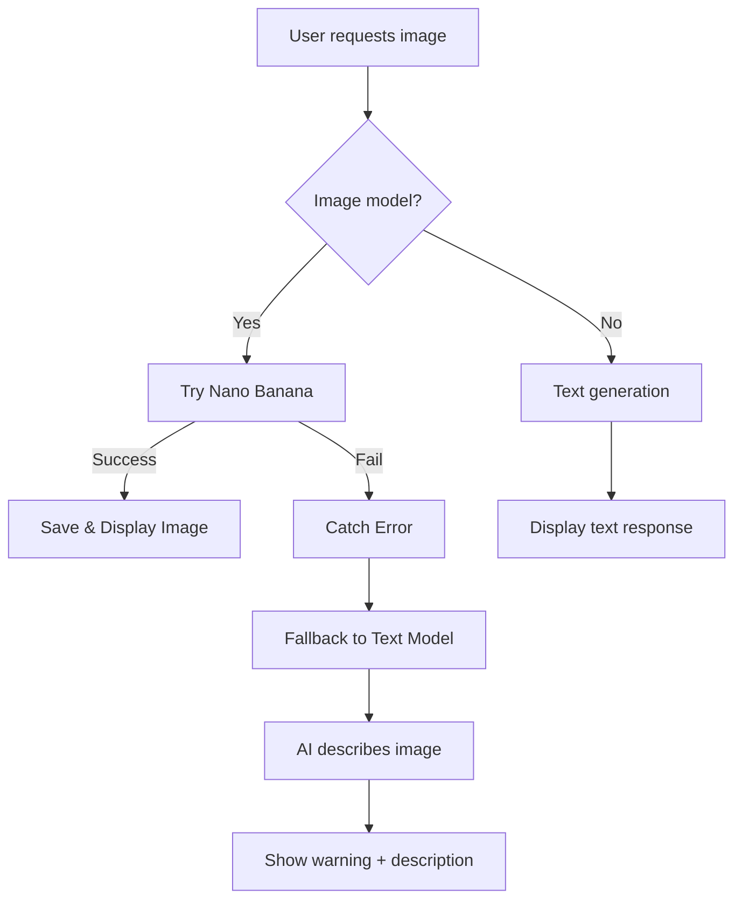

# Nano Banana Image Generation - Troubleshooting Guide

## 🚨 Common Issues

### 1. Quota Exceeded Error

**Error Message:**

```
Quota exceeded for metric: generativelanguage.googleapis.com/generate_content_free_tier_requests
```

**Penyebab:**

- Gemini API free tier memiliki quota terbatas untuk image generation
- Quota biasanya: 15 requests/day untuk image models (free tier)

**Solusi:**

#### Option 1: Tunggu Quota Reset

- Quota reset setiap 24 jam
- Check status quota di: https://ai.dev/rate-limit

#### Option 2: Upgrade ke Paid Plan

- Paid plan memiliki quota lebih tinggi
- Info pricing: https://ai.google.dev/pricing

#### Option 3: Gunakan Automatic Fallback (Sudah Diimplementasi)

Sistem akan otomatis fallback ke text model jika image generation gagal:

```
⚠️ Maaf, image generation tidak tersedia saat ini (quota habis atau error).

[AI akan mendeskripsikan gambar yang diminta dalam teks]
```

---

## 📋 Model Information

### Nano Banana (gemini-2.5-flash-image)

- **Type**: Fast & Efficient
- **Best for**: Quick image generation, prototyping
- **Speed**: ~3-5 seconds
- **Quality**: Good
- **Quota (Free Tier)**: 15 requests/day

### Nano Banana Pro (gemini-3-pro-image-preview)

- **Type**: Professional Quality
- **Best for**: High-fidelity images, text rendering, professional assets
- **Speed**: ~5-10 seconds
- **Quality**: Excellent
- **Features**: Advanced reasoning ("Thinking")
- **Quota (Free Tier)**: Limited (check docs)

---

## ✅ Current Implementation

### Automatic Fallback Strategy

When image generation fails (quota, error, etc):

1. **Catches Error**: System detects image generation failure
2. **Fallback to Text**: Switches to `gemini-3-flash-preview`
3. **User Notification**: Shows warning message
4. **Helpful Response**: AI describes what image would look like
5. **No Breaking**: Chat continues normally

### Code Flow



---

## 🔧 Configuration

### Environment Variables

Pastikan `.env.local` memiliki:

```env
GEMINI_API_KEY=your_api_key_here
```

### Model List

Update model list di frontend jika ada perubahan:

- `src/app/dashboard/chat/[roomSlug]/page.jsx`
- `src/app/api/ai/chat/route.js`

---

## 📊 Monitoring Quota

Check quota usage:

```bash
# Visit Google AI Studio
https://ai.dev/rate-limit

# View current usage
# View limits per model
# See reset time
```

---

## 🎯 Best Practices

### 1. Test dengan Free Models Dulu

Sebelum generate banyak images, test dulu dengan text models.

### 2. Cache Generated Images

Images yang sudah di-generate disimpan di:

```
/public/uploads/ai-generated/
```

### 3. Monitor Quota

Check quota sebelum demo atau presentation penting.

### 4. Informative Prompts

Gunakan prompt yang jelas dan detail untuk hasil optimal:

```
✅ Good: "Create a photorealistic sunset over mountains with purple sky and orange clouds"
❌ Bad: "sunset"
```

---

## 🐛 Debugging

### Enable Verbose Logging

Error sudah di-log di console dengan prefix `❌`.

Check terminal untuk:

```
❌ Error generating image: [error details]
❌ Image generation failed, falling back to text response: [reason]
```

### Common Fixes

**Issue**: Model not found

```javascript
// Wrong
model: "gemini-flash-image";

// Correct
model: "gemini-2.5-flash-image";
```

**Issue**: Quota exceeded

- Wait 24 hours
- Or upgrade to paid plan
- Or use fallback (automatic)

**Issue**: Invalid API key

```env
# Check .env.local
GEMINI_API_KEY=AIza...  # Must start with AIza
```

---

## 📞 Support

- **Gemini API Docs**: https://ai.google.dev/gemini-api/docs
- **Rate Limits**: https://ai.google.dev/gemini-api/docs/rate-limits
- **Pricing**: https://ai.google.dev/pricing
- **Community**: https://discuss.ai.google.dev
