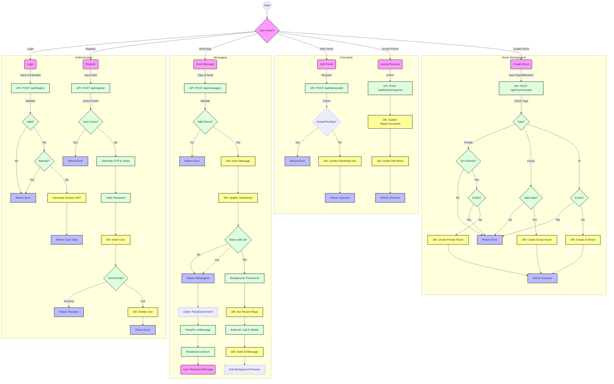

# Activity Diagram

This document contains the Activity Diagram for the Chit-Chat-V5AI application, reflecting the actual code implementation.

## System Overview

The system consists of 4 main components:

1.  **User**: The end-user interacting with the UI.
2.  **Client (Next.js)**: The frontend application running in the browser.
3.  **Server (Next.js API & PartyKit)**: The backend handling logic, database, and real-time events.
4.  **Database (MongoDB)**: The persistent storage.

## Main Activity Flows

## Detailed Activity Sequences

### 1. Send Message Sequence

1.  **User** types message and clicks send.
2.  **Client** calls `POST /api/messages` with content and `roomId`.
3.  **API** validates user session and room membership.
4.  **API** generates `messageId` and saves to MongoDB.
5.  **API** updates `lastMessage` and `lastActivity` in `Room` collection.
6.  **API** returns success with `messageId` to **Client**.
7.  **Client** emits message via **PartyKit** websocket.
8.  **PartyKit Server** receives event and broadcasts to all connected clients in the room.
9.  **User** (Peer) receives update and UI refreshes.

### 2. AI Command Sequence (/ai)

1.  **User** sends message starting with `/ai`.
2.  **API** processes standard message saving (steps 1-6 above).
3.  **API** triggers background process:
    - Fetches recent chat history from DB.
    - Calls internal AI endpoint.
    - Saves AI response to MongoDB as a new message.
    - Updates Room's last message.

### 3. Login Sequence

1.  **User** submits credentials.
2.  **NextAuth** verifies `username`/`email` and `password` (bcrypt comparison).
3.  **NextAuth** checks `isBanned` and `suspendedUntil`.
4.  **NextAuth** creates JWT session if valid.

### 4. Register Sequence

1.  **User** submits registration form.
2.  **API** validates input and checks for duplicates.
3.  **API** generates verification token and OTP.
4.  **API** hashes password and creates user (status: unverified).
5.  **API** attempts to send verification email.
    - **Success**: Returns success message.
    - **Failure**: Deletes the newly created user and returns error.

### 5. Create Room Sequence

1.  **Client** sends request with `type` (private/group/ai), `name`, and `memberIds`.
2.  **API** validates request body based on room type.
3.  **API** checks constraints:
    - **Private**: Must be friends, no existing private room.
    - **AI**: No existing AI room.
    - **Group**: Valid name and members.
4.  **API** generates unique `roomId` and `slug`.
5.  **API** inserts new room document into `rooms` collection.
6.  **API** returns success with room details.
