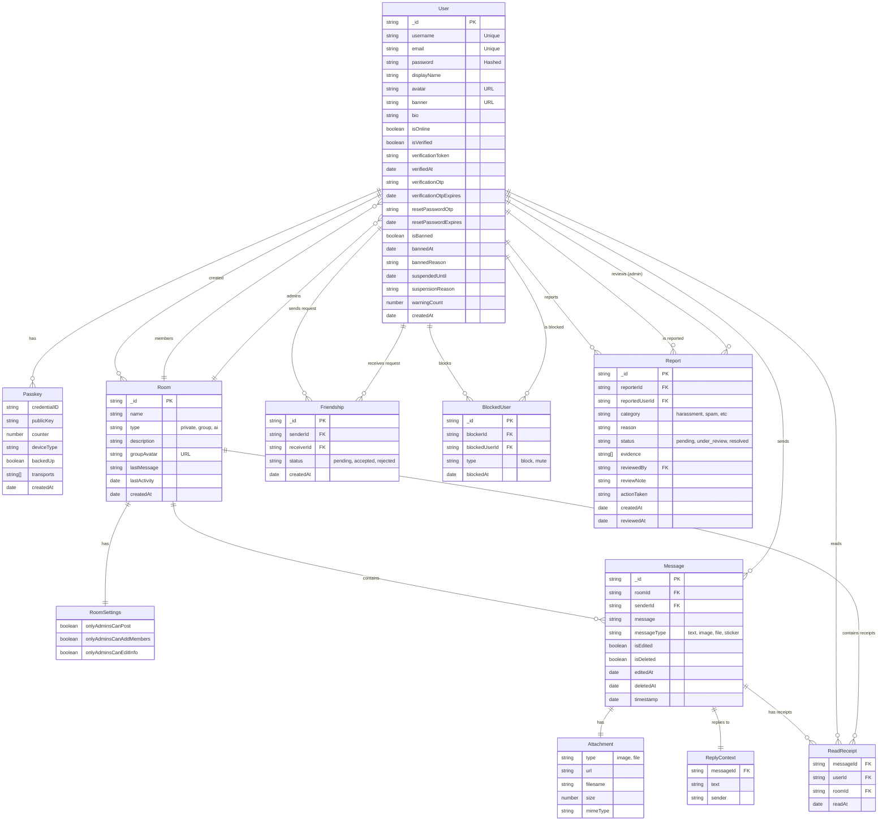

```mermaid
erDiagram
    %% Entities
    User {
        string _id PK
        string username "Unique"
        string email "Unique"
        string password "Hashed"
        string displayName
        string avatar "URL"
        string banner "URL"
        string bio
        boolean isOnline
        boolean isVerified
        string verificationToken
        date verifiedAt
        string verificationOtp
        date verificationOtpExpires
        string resetPasswordOtp
        date resetPasswordExpires
        boolean isBanned
        date bannedAt
        string bannedReason
        date suspendedUntil
        string suspensionReason
        number warningCount
        date createdAt
    }

    Passkey {
        string credentialID
        string publicKey
        number counter
        string deviceType
        boolean backedUp
        string[] transports
        date createdAt
    }

    Room {
        string _id PK
        string name
        string type "private, group, ai"
        string description
        string groupAvatar "URL"
        string lastMessage
        date lastActivity
        date createdAt
    }

    RoomSettings {
        boolean onlyAdminsCanPost
        boolean onlyAdminsCanAddMembers
        boolean onlyAdminsCanEditInfo
    }

    Message {
        string _id PK
        string roomId FK
        string senderId FK
        string message
        string messageType "text, image, file, sticker"
        boolean isEdited
        boolean isDeleted
        date editedAt
        date deletedAt
        date timestamp
    }

    Attachment {
        string type "image, file"
        string url
        string filename
        number size
        string mimeType
    }

    ReplyContext {
        string messageId FK
        string text
        string sender
    }

    Friendship {
        string _id PK
        string senderId FK
        string receiverId FK
        string status "pending, accepted, rejected"
        date createdAt
    }

    BlockedUser {
        string _id PK
        string blockerId FK
        string blockedUserId FK
        string type "block, mute"
        date blockedAt
    }

    Report {
        string _id PK
        string reporterId FK
        string reportedUserId FK
        string category "harassment, spam, etc"
        string reason
        string status "pending, under_review, resolved"
        string[] evidence
        string reviewedBy FK
        string reviewNote
        string actionTaken
        date createdAt
        date reviewedAt
    }

    ReadReceipt {
        string messageId FK
        string userId FK
        string roomId FK
        date readAt
    }

    %% Relationships
    User ||--o{ Passkey : "has"

    User ||--o{ Room : "created"
    Room ||--o{ User : "members"
    Room ||--o{ User : "admins"
    Room ||--|| RoomSettings : "has"

    Room ||--o{ Message : "contains"
    User ||--o{ Message : "sends"
    Message ||--|| Attachment : "has"
    Message ||--|| ReplyContext : "replies to"

    User ||--o{ Friendship : "sends request"
    User ||--o{ Friendship : "receives request"

    User ||--o{ BlockedUser : "blocks"
    User ||--o{ BlockedUser : "is blocked"

    User ||--o{ Report : "reports"
    User ||--o{ Report : "is reported"
    User ||--o{ Report : "reviews (admin)"

    Message ||--o{ ReadReceipt : "has receipts"
    User ||--o{ ReadReceipt : "reads"
    Room ||--o{ ReadReceipt : "contains receipts"
```
