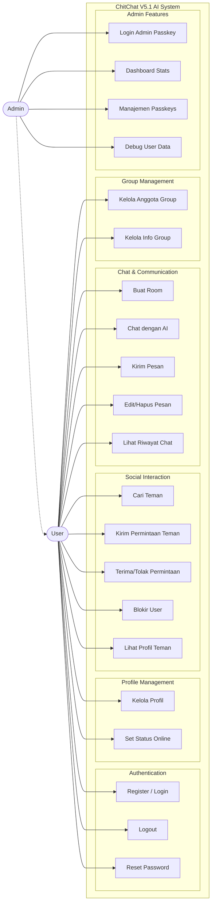

# Use Case Diagram - Chit-Chat V5.1 AI

> **Diagram Use Case untuk Sistem Chit-Chat V5.1 AI**
>
> Menampilkan semua use case untuk User dan Admin

---

---

## 📝 Penjelasan Use Case

### Aktor

1. **User (Pengguna)** - Pengguna biasa aplikasi
2. **Admin (Administrator)** - Administrator sistem dengan akses penuh

### Use Case Berdasarkan Kategori

#### 1. Authentication

- **UC1**: Register / Login - Mendaftar akun baru atau login
- **UC2**: Logout - Keluar dari aplikasi
- **UC3**: Reset Password - Reset password via email OTP

#### 2. Profile Management

- **UC4**: Kelola Profil - Edit avatar, bio, display name
- **UC5**: Set Status Online - Mengatur status online/offline

#### 3. Social Interaction

- **UC6**: Cari Teman - Mencari user lain berdasarkan username/email
- **UC7**: Kirim Permintaan Teman - Mengirim friend request
- **UC8**: Terima/Tolak Permintaan - Merespon friend request
- **UC9**: Blokir User - Memblokir user lain
- **UC10**: Lihat Profil Teman - Melihat profil detail teman

#### 4. Chat & Communication

- **UC11**: Buat Room - Membuat room private, group, atau AI
- **UC12**: Chat dengan AI - Berkomunikasi dengan AI Assistant
- **UC13**: Kirim Pesan - Mengirim pesan text/media
- **UC14**: Edit/Hapus Pesan - Mengedit atau menghapus pesan
- **UC15**: Lihat Riwayat Chat - Melihat history pesan

#### 5. Group Management

- **UC16**: Kelola Anggota Group - Tambah/hapus member, promote admin
- **UC17**: Kelola Info Group - Edit nama, deskripsi, avatar group

#### 6. Admin Features

- **UC18**: Login Admin Passkey - Login admin menggunakan WebAuthn
- **UC19**: Dashboard Stats - Melihat statistik sistem
- **UC20**: Manajemen Passkeys - Kelola passkey credentials
- **UC21**: Debug User Data - Debug data user untuk troubleshooting

---

## 🎯 Relasi Antar Aktor

- **Admin -.-> User**: Admin memiliki semua akses User + fitur admin tambahan
- **User --> Use Cases**: User dapat mengakses 17 use cases
- **Admin --> Use Cases**: Admin dapat mengakses 4 use cases khusus admin

---

**Total Use Cases**: 21  
**Dibuat pada**: 2026-02-01  
**Status**: ✅ Complete
