# Data Flow Diagram (DFD) - Chit-Chat V5.1 AI

> **Dokumentasi DFD Lengkap untuk Sistem Chit-Chat V5.1 AI**
>
> Diagram ini menunjukkan alur data lengkap dalam sistem, dari Level 0 (Context Diagram) hingga Level 2 (Detail Process).

---

## 📊 DFD Level 0: Context Diagram

**Context Diagram** menunjukkan sistem sebagai satu proses tunggal dengan interaksi ke entitas eksternal.

```mermaid
flowchart TD
    %% External Entities
    User([👤 User / Pengguna])
    Admin([👨‍💼 Admin])
    EmailSystem([📧 Email System / SMTP])
    AISystem([🤖 AI Service / Gemini LLM])

    %% Main System
    System((Chit-Chat V5.1 AI<br/>System))

    %% User Interactions
    User -->|Login Credentials<br/>Registration Data<br/>Profile Updates| System
    User -->|Friend Requests<br/>Messages<br/>Room Creation| System
    System -->|Authentication Token<br/>Chat History<br/>Friend List| User
    System -->|Notifications<br/>Online Status<br/>Room Updates| User

    %% Admin Interactions
    Admin -->|Admin Passkey<br/>Management Commands<br/>Review Actions| System
    System -->|Dashboard Stats<br/>User Reports<br/>System Logs| Admin
    System -->|Moderation Actions| Admin

    %% Email System
    System -->|Verification Email<br/>OTP Codes<br/>Password Reset| EmailSystem
    EmailSystem -->|Delivery Status| System

    %% AI System
    System -->|User Prompt<br/>Conversation Context| AISystem
    AISystem -->|AI Response<br/>Generated Content| System

    style System fill:#4a90e2,stroke:#2c5aa0,stroke-width:3px,color:#fff
    style User fill:#34c759,stroke:#248a3d,stroke-width:2px,color:#fff
    style Admin fill:#ff9500,stroke:#cc7700,stroke-width:2px,color:#fff
    style EmailSystem fill:#af52de,stroke:#8e44ad,stroke-width:2px,color:#fff
    style AISystem fill:#ff375f,stroke:#cc2b4c,stroke-width:2px,color:#fff
```



---

## 📋 DFD Level 1: Major Processes

**Level 1** memecah sistem menjadi 7 proses utama dengan data stores.


---

## 🔍 DFD Level 2: Detailed Sub-Processes

### 2.1 Authentication & Authorization (Detail)


---

### 2.2 User Profile Management (Detail)


---

### 2.3 Friendship Management (Detail)


---

### 2.4 Room Management (Detail)


---

### 2.5 Message Management (Detail)


---

### 2.6 AI Chat Integration (Detail)


---

### 2.7 Admin Management (Detail)


---

## 📝 Penjelasan DFD

### Level 0 - Context Diagram

- **Fungsi**: Menampilkan sistem sebagai satu kesatuan dengan 4 entitas eksternal
- **Entitas Eksternal**:
  - **User**: Pengguna aplikasi (chat, friend management)
  - **Admin**: Administrator sistem (management, moderation)
  - **Email System**: SMTP untuk verifikasi email dan reset password
  - **AI System**: Gemini LLM untuk AI chat assistant

### Level 1 - Major Processes

Sistem dipecah menjadi 7 proses utama:

1. **Authentication & Authorization** - Login, register, passkey, verification
2. **User Profile Management** - Profile, avatar, banner, password
3. **Friendship Management** - Add friend, accept, reject, block
4. **Room Management** - Create rooms (private/group/AI)
5. **Message Management** - Send, edit, delete messages, read receipts
6. **AI Chat Integration** - AI processing dan response generation
7. **Admin Management** - Dashboard, user management, reports

### Level 2 - Detailed Sub-Processes

Setiap proses Level 1 dipecah menjadi sub-proses detail dengan alur data lengkap:

- **2.1**: Authentication detail (6 sub-process)
- **2.2**: User Profile detail (6 sub-process)
- **2.3**: Friendship detail (6 sub-process)
- **2.4**: Room Management detail (8 sub-process)
- **2.5**: Message Management detail (7 sub-process)
- **2.6**: AI Integration detail (5 sub-process)
- **2.7**: Admin Management detail (6 sub-process)

### Data Stores (MongoDB Collections)

1. **Users** - User accounts, profiles, authentication
2. **Passkeys** - WebAuthn credentials
3. **Friendships** - Friend relationships
4. **Rooms** - Chat rooms (private, group, AI)
5. **Messages** - Chat messages with attachments

---

## 🎯 Kesesuaian dengan Codebase

DFD ini dibuat berdasarkan analisis **100% sesuai** dengan codebase:

✅ **Database Schema**: `database-schema.dbml`
✅ **API Endpoints**: `docs/API_REFERENCE.md`
✅ **ERD**: `docs/ERD_MERMAID.md`
✅ **Use Case**: `docs/USECASE_DIAGRAM.md`
✅ **Activity Diagram**: `docs/ACTIVITY_DIAGRAM.md`
✅ **Authentication**: NextAuth 5.0 with Passkey support
✅ **Real-time**: Socket.io for live messaging
✅ **AI Integration**: Gemini API integration
✅ **Admin System**: Passkey-based admin authentication

---

## 📦 Export untuk Draw.io

Diagram Mermaid di atas dapat diimport ke Draw.io dengan cara:

1. Copy kode Mermaid (dalam blok ```mermaid)
2. Buka Draw.io → **Arrange** → **Insert** → **Advanced** → **Mermaid**
3. Paste kode Mermaid
4. Klik **Insert**

Atau gunakan plugin Mermaid di Draw.io untuk edit langsung.

---

**Dibuat pada**: 2026-02-01  
**Versi**: 1.0  
**Status**: ✅ Complete & Verified
