# DFD Level 2: Detailed Process Breakdowns - Chit-Chat V5.1 AI

Dokumen ini berisi **DFD Level 2** untuk semua process dalam sistem Chit-Chat V5.1 AI, berdasarkan implementasi frontend dan backend aktual.

> **Note:** Dokumentasi ini berisi penjelasan text-only dan Mermaid diagram. Diagram dapat di-import ke Draw.io menggunakan plugin Mermaid.

---

## Process 1.0: Authentication & Authorization

### External Entities

- **User** (Pengguna)
- **Email System** (SMTP)

### Sub-Processes

1. **1.1 Register**
2. **1.2 Login Standard**
3. **1.3 Login Passkey (WebAuthn)**
4. **1.4 Email Verification**
5. **1.5 Password Reset**
6. **1.6 Manage Passkeys**

### Data Stores

- `users` - Data pengguna dengan auth credentials
- `passkeys` - WebAuthn credentials

### Data Flows

#### 1.1 Register

**Input:** Username, Email, Password, DisplayName dari User  
**Proses:**

1. User mengirim data registrasi ke P1.1
2. P1.1 mengecek duplikat email/username di `users`
3. P1.1 hash password dengan bcrypt (10 rounds)
4. P1.1 generate custom ID (format: usr000001)
5. P1.1 create user record → `users`
6. P1.1 trigger P1.4 untuk verifikasi email

**Output:** Success message & User ID ke User

---

#### 1.2 Login Standard

**Input:** Email/Username & Password dari User  
**Pros:**

1. User mengirim credentials ke P1.2
2. P1.2 fetch user data dari `users` by email/username
3. P1.2 verify password dengan bcrypt.compare
4. P1.2 update `isOnline = true` → `users`
5. P1.2 create NextAuth session (7-day expiry, 1-day sliding refresh)

**Output:** Session token & User profile ke User

---

#### 1.3 Login Passkey (WebAuthn)

**Input:** Passkey challenge response dari User  
**Proses:**

1. User mengirim challenge response ke P1.3
2. P1.3 fetch public key & counter dari `passkeys`
3. P1.3 verify signature menggunakan WebAuthn library
4. P1.3 update counter (replay protection) → `passkeys`
5. P1.3 fetch user data dari `users`
6. P1.3 create NextAuth session

**Output:** Session token ke User

---

#### 1.4 Email Verification

**Proses:**

- P1.1 atau P1.5 request generate verification token
- Generate unique token (UUID)
- Save token to `users.verificationToken`
- Send verification email → EmailSystem
- User click link atau input OTP
- P1.4 validate token
- Update `isVerified = true` & `verifiedAt = timestamp` → `users`

---

#### 1.5 Password Reset

**Step 1: Request Reset**

- User → Email → P1.5
- P1.5 → Check User Exists → `users`
- P1.5 → Generate 6-digit OTP
- P1.5 → Save OTP + Expiry (15 min) → `users.resetPasswordOtp`
- P1.5 → Send OTP Email → EmailSystem

**Step 2: Verify OTP & Reset Password**

- User → OTP + New Password → P1.5
- P1.5 → Validate OTP & Expiry → `users`
- P1.5 → Hash New Password (bcrypt)
- P1.5 → Update Password → `users`
- P1.5 → Clear OTP fields → `users`

**Output:** Success message ke User

---

#### 1.6 Manage Passkeys

**Register New Passkey:**

1. User → Register Passkey Request → P1.6
2. P1.6 → Create WebAuthn Challenge
3. User → Challenge Response (credentialID, publicKey) → P1.6
4. P1.6 → Save Credential → `passkeys`

**List Passkeys:**

- User → Request Passkey List → P1.6
- P1.6 → Fetch User Passkeys → `passkeys`
- P1.6 → Passkey List (with deviceType, createdAt) → User

**Delete Passkey:**

- User → Delete Passkey (credentialID) → P1.6
- P1.6 → Remove Passkey → `passkeys`

---

## Process 2.0: User Profile Management

### External Entities

- **User** (All roles)

### Sub-Processes

1. **2.1 View Profile**
2. **2.2 Update Profile**
3. **2.3 Upload Avatar**
4. **2.4 Upload Banner**
5. **2.5 Change Password**
6. **2.6 Search Users**

### Data Stores

- `users` - Profile data

### Data Flows

#### 2.1 View Profile

**Input:** User ID (self or other user)  
**Proses:**

1. User → Request Profile → P2.1
2. P2.1 → Fetch User Data (exclude password) → `users`
3. P2.1 → Profile Data (displayName, avatar, banner, bio, isOnline) → User

**Output:** Profile data ke User

---

#### 2.2 Update Profile

**Input:** DisplayName, Bio dari User  
**Proses:**

1. User → Update Profile Data → P2.2
2. P2.2 → Validate Data (length limits)
3. P2.2 → Update Profile → `users`

**Fields Editable:**

- `displayName` (max 50 chars)
- `bio` (max 200 chars)

**Note:** Username & Email tidak bisa diubah setelah registrasi

---

#### 2.3 Upload Avatar

**Input:** Image file dari User  
**Proses:**

1. User → Upload Avatar Image → P2.3
2. P2.3 → Validate (size < 5MB, format: jpg/png/webp)
3. P2.3 → Crop to 1:1 aspect ratio (using react-easy-crop)
4. P2.3 → Save to storage / File system
5. P2.3 → Get Avatar URL
6. P2.3 → Update `users.avatar = URL` → `users`

**Output:** New Avatar URL ke User

---

#### 2.4 Upload Banner

**Input:** Image file dari User  
**Proses:**

1. User → Upload Banner Image → P2.4
2. P2.4 → Validate (size < 10MB, format: jpg/png/webp)
3. P2.4 → Crop to 16:9 aspect ratio
4. P2.4 → Save to storage
5. P2.4 → Update `users.banner = URL` → `users`

**Output:** New Banner URL ke User

---

#### 2.5 Change Password

**Input:** Current Password, New Password dari User  
**Proses:**

1. User → Current & New Password → P2.5
2. P2.5 → Fetch User → `users`
3. P2.5 → Verify Current Password (bcrypt.compare)
4. P2.5 → Validate New Password (min 8 chars)
5. P2.5 → Hash New Password (bcrypt)
6. P2.5 → Update Password → `users`

**Output:** Success message ke User

---

#### 2.6 Search Users

**Input:** Search query dari User  
**Proses:**

1. User → Search Query → P2.6
2. P2.6 → Search by username OR displayName (case-insensitive, regex) → `users`
3. P2.6 → Limit 10 results
4. P2.6 → Exclude self dari results
5. P2.6 → User List (userId, username, displayName, avatar) → User

**Output:** Search results ke User

---

## Process 3.0: Friendship Management

### External Entities

- **User**

### Sub-Processes

1. **3.1 Send Friend Request**
2. **3.2 Accept Request**
3. **3.3 Reject Request**
4. **3.4 Get Friend List**
5. **3.5 Block User**
6. **3.6 Remove Friend**

### Data Stores

- `users` - User information
- `friendships` - Friend relationships
- `blocked_users` - Block list
- `rooms` - Auto-created private rooms

### Data Flows

#### 3.1 Send Friend Request

**Input:** Target username atau email dari User  
**Proses:**

1. User → Identifier (username/email) → P3.1
2. P3.1 → Search Target User → `users`
3. P3.1 → Validate: tidak bisa add self
4. P3.1 → Check Existing Friendship → `friendships`
5. P3.1 → Check if Blocked → `blocked_users`
6. P3.1 → Create Friendship (senderId, receiverId, status: pending) → `friendships`

**Output:** Request sent confirmation ke User

**Validation:**

- Target user must exist
- Cannot add yourself
- Cannot have existing friendship (accepted/pending)
- Cannot add if blocked

---

#### 3.2 Accept Request

**Input:** Friendship ID, Action: accept dari User  
**Proses:**

1. User → Accept Friendship → P3.2
2. P3.2 → Verify User is Receiver → `friendships`
3. P3.2 → Update status = 'accepted' → `friendships`
4. P3.2 → Trigger P4.1 (Create Private Room)
5. P3.2 → Create Private Room (type: private, members: [sender, receiver]) → `rooms`

**Output:** Friend added + Room created message ke User

---

#### 3.3 Reject Request

**Input:** Friendship ID, Action: reject dari User  
**Proses:**

1. User → Reject Friendship → P3.3
2. P3.3 → Verify User is Receiver → `friendships`
3. P3.3 → Update status = 'rejected' → `friendships`

**Output:** Request rejected ke User

---

#### 3.4 Get Friend List

**Input:** Request dari User  
**Proses:**

1. User → Get Friends → P3.4
2. P3.4 → Fetch All Friendships (senderId OR receiverId = userId) → `friendships`
3. P3.4 → Filter by status:
   - `friends`: status = 'accepted'
   - `pendingReceived`: receiverId = userId AND status = 'pending'
   - `pendingSent`: senderId = userId AND status = 'pending'
4. P3.4 → Get Friend User Details → `users`
5. P3.4 → Format Friend Data (userId, username, displayName, avatar, isOnline)

**Output:**

- `friends[]` - List teman yang sudah diterima
- `pendingReceived[]` - Request yang diterima (masih pending)
- `pendingSent[]` - Request yang dikirim (masih pending)
- `counts` - Total each category

---

#### 3.5 Block User

**Input:** Target User ID dari User  
**Proses:**

1. User → Block User ID → P3.5
2. P3.5 → Create BlockedUser (blockerId, blockedUserId, type: block) → `blocked_users`
3. P3.5 → Delete existing friendship (if any) → `friendships`
4. P3.5 → Update room access (remove from shared rooms)

**Output:** User blocked confirmation

**Effect:**

- Cannot send/receive friend requests
- Cannot see each other in search
- Cannot chat (if in same room, messages filtered)

---

#### 3.6 Remove Friend

**Input:** Friendship ID dari User  
**Proses:**

1. User → Remove Friend → P3.6
2. P3.6 → Verify Ownership (user is sender OR receiver) → `friendships`
3. P3.6 → Delete Friendship → `friendships`
4. P3.6 → Keep private room (but mark as inactive or soft-delete)

**Output:** Friend removed confirmation

**Note:** Private room tetap ada untuk history, tapi tidak tampil di active rooms

---

## Process 4.0: Room Management

### External Entities

- **User**

### Sub-Processes

1. **4.1 Create Private Room**
2. **4.2 Create Group Room**
3. **4.3 Create AI Room**
4. **4.4 Get Room List**
5. **4.5 Get Room by Slug**
6. **4.6 Update Room Info**
7. **4.7 Manage Members**
8. **4.8 Leave Room**

### Data Stores

- `rooms` - All room data
- `friendships` - For private room validation
- `users` - Member details
- `messages` - For lastMessage preview

### Data Flows

#### 4.1 Create Private Room

**Input:** Friend User ID dari User  
**Proses:**

1. User → Create Private Room with Friend → P4.1
2. P4.1 → Verify Friendship (status = accepted) → `friendships`
3. P4.1 → Check Existing Private Room → `rooms`
4. P4.1 → Get Friend Name → `users`
5. P4.1 → Create Room:
   - `type = 'private'`
   - `name = 'Chat dengan [Friend Name]'`
   - `members = [userId, friendId]`
   - `createdBy = userId`
6. P4.1 → Save Room → `rooms`

**Output:** Room created → User

**Note:** Triggered automatically by P3.2 (Accept Friend Request)

---

#### 4.2 Create Group Room

**Input:** Room Name, Member IDs, Description dari User  
**Proses:**

1. User → Create Group (name, memberIds[], description) → P4.2
2. P4.2 → Validate Members Exist → `users`
3. P4.2 → Create Room:
   - `type = 'group'`
   - `name = user_input_name`
   - `members = [creator, ...memberIds]`
   - `admins = [creator]`
   - `createdBy = userId`
4. P4.2 → Save Room → `rooms`

**Output:** Group created → User

---

#### 4.3 Create AI Room

**Input:** Request AI Chat dari User  
**Proses:**

1. User → Start AI Chat → P4.3
2. P4.3 → Check Existing AI Room → `rooms` (WHERE type = 'ai' AND members contains userId)
3. If exists → Return existing room
4. If not exists:
   - Create Room:
     - `type = 'ai'`
     - `name = 'AI Assistant'`
     - `members = [userId]`
     - `createdBy = userId`
5. P4.3 → Save Room → `rooms`

**Output:** AI Room ID → User

---

#### 4.4 Get Room List

**Input:** Request dari User  
**Proses:**

1. User → Get All Rooms → P4.4
2. P4.4 → Fetch Rooms (WHERE members contains userId AND NOT deleted) → `rooms`
3. P4.4 → Sort by lastActivity DESC
4. P4.4 → For each room:
   - Get Member Details → `users`
   - For private: get friend data (username, displayName, avatar, isOnline)
   - For group: get all member profiles
   - For AI: return AI metadata
5. P4.4 → Group by type (private, group, ai)
6. P4.4 → Calculate counts

**Output:**

- `rooms[]` - All rooms sorted by activity
- `grouped.private[]`, `grouped.group[]`, `grouped.ai[]`
- `counts` - Total per type
- Each room includes: id, name, type, slug, lastMessage, lastActivity, memberCount, friend/members

---

#### 4.5 Get Room by Slug

**Input:** Slug (username atau room-name) dari User  
**Proses:**

1. User → Request Room by Slug → P4.5
2. P4.5 → Slug Resolution Strategy:
   - **AI Room**: IF slug = 'ai-assistant' → Find AI room
   - **Private Room**: Find user by username → Find private room with that user
   - **Group Room**: Match slugified room name
3. P4.5 → Verify User is Member → `rooms.members`
4. P4.5 → Get Room Details → `rooms`
5. P4.5 → Get Member/Friend Info → `users`

**Output:** Room data with full details → User

**Examples:**

- `/dashboard/john` → Private room dengan user "john"
- `/dashboard/dev-team` → Group room "Dev Team"
- `/dashboard/ai-assistant` → AI room

---

#### 4.6 Update Room Info

**Input:** Room ID, Updated Fields (name, description, groupAvatar) dari User  
**Proses:**

1. User → Update Room Info → P4.6
2. P4.6 → Verify User is Admin → `rooms.admins[]`
3. P4.6 → Validate Fields
4. P4.6 → Update Room → `rooms`

**Editable Fields (Group only):**

- `name` - Group name
- `description` - Group description
- `groupAvatar` - Group avatar URL
- `settings.*` - Group settings

**Note:** Private & AI rooms tidak bisa diupdate

---

#### 4.7 Manage Members

**Input:** Room ID, Action (add/remove/promote), Target User ID dari User  
**Proses:**

1. User → Manage Members → P4.7
2. P4.7 → Verify User is Admin → `rooms.admins[]`
3. P4.7 → Check Settings (onlyAdminsCanAddMembers) → `rooms`
4. P4.7 → Perform Action:
   - **Add**: Push userId to `rooms.members[]`
   - **Remove**: Pull userId from `rooms.members[]`
   - **Promote**: Push userId to `rooms.admins[]`
   - **Demote**: Pull userId from `rooms.admins[]`
5. P4.7 → Update Room → `rooms`

**Output:** Members updated → User

**Note:** Hanya untuk group rooms

---

#### 4.8 Leave Room

**Input:** Room ID dari User  
**Proses:**

1. User → Leave Room → P4.8
2. P4.8 → Remove userId from `rooms.members[]`
3. P4.8 → IF user is admin: remove from `rooms.admins[]`
4. P4.8 → IF last member: soft-delete room (set deletedAt)
5. P4.8 → Update Room → `rooms`

**Output:** Left room confirmation → User

---

## Process 5.0: Message Management

### External Entities

- **User**

### Sub-Processes

1. **5.1 Send Text Message**
2. **5.2 Send Media Message**
3. **5.3 Get Message History**
4. **5.4 Edit Message**
5. **5.5 Delete Message**
6. **5.6 Read Receipts**
7. **5.7 Real-time Broadcast**

### Data Stores

- `messages` - Message data
- `rooms` - Room activity updates
- `users` - Sender info
- `read_receipts` - Read status

### Data Flows

#### 5.1 Send Text Message

**Input:** Room ID, Message Text dari User  
**Proses:**

1. User → Send Message (roomId, message, type: text) → P5.1
2. P5.1 → Verify Room Membership → `rooms.members[]`
3. P5.1 → Create Message:
   - `senderId = userId`
   - `roomId = roomId`
   - `message = text`
   - `messageType = 'text'`
   - `timestamp = now()`
4. P5.1 → Save Message → `messages`
5. P5.1 → Update Room:
   - `lastMessage = text.substring(0, 50)`
   - `lastActivity = now()`
     → `rooms`
6. P5.1 → Trigger P5.7 (Broadcast via Socket.io)

**Output:** Message sent confirmation + messageId → User

---

#### 5.2 Send Media Message

**Input:** Room ID, Image/File dari User  
**Proses:**

1. User → Send Media (roomId, file) → P5.2
2. P5.2 → Verify Room Membership → `rooms.members[]`
3. P5.2 → Validate File (size, type, extension)
4. P5.2 → Upload to Storage / File System
5. P5.2 → Get File URL & Metadata (filename, size, mimeType)
6. P5.2 → Create Message:
   - `messageType = 'image'` or `'file'`
   - `message = filename` (as caption if provided)
   - `attachment.type = type`
   - `attachment.url = url`
   - `attachment.filename = filename`
   - `attachment.size = size`
   - `attachment.mimeType = mimeType`
7. P5.2 → Save Message → `messages`
8. P5.2 → Update Room Activity → `rooms`
9. P5.2 → Trigger P5.7 (Broadcast)

**Output:** Media sent → User

**Supported Types:**

- Image: jpg, png, webp, gif
- File: pdf, doc, txt, zip, etc.

---

#### 5.3 Get Message History

**Input:** Room ID, Limit (default 30), Before (timestamp for pagination) dari User  
**Proses:**

1. User → Get Messages (roomId, limit, before) → P5.3
2. P5.3 → Verify Room Membership → `rooms.members[]`
3. P5.3 → Query Messages:
   - WHERE `roomId = roomId`
   - AND `isDeleted = false`
   - AND `timestamp < before` (if provided)
   - ORDER BY `timestamp DESC`
   - LIMIT `limit + 1`
     → `messages`
4. P5.3 → For each message:
   - Get Sender Info (userId, username, displayName, avatar) → `users`
   - Check if `isOwn = senderId === userId`
5. P5.3 → Calculate `hasMore` (if results > limit)
6. P5.3 → Get oldest timestamp for pagination

**Output:**

- `messages[]` - Array of messages (oldest to newest after reverse)
- `hasMore` - Boolean for pagination
- `oldestTimestamp` - For next page

**WhatsApp-style Pagination:**

- Load 30 messages initially
- When user scrolls up, load more with `before = oldestTimestamp`

---

#### 5.4 Edit Message

**Input:** Message ID, New Text dari User  
**Proses:**

1. User → Edit Message → P5.4
2. P5.4 → Fetch Message → `messages`
3. P5.4 → Verify Ownership (senderId = userId)
4. P5.4 → Validate: type must be 'text', not deleted
5. P5.4 → Update Message:
   - `message = new_text`
   - `isEdited = true`
   - `editedAt = now()`
     → `messages`
6. P5.4 → Broadcast edit via Socket.io

**Output:** Message edited → User

**Note:** Only text messages can be edited, within 48 hours

---

#### 5.5 Delete Message

**Input:** Message ID dari User  
**Proses:**

1. User → Delete Message → P5.5
2. P5.5 → Fetch Message → `messages`
3. P5.5 → Verify Ownership (senderId = userId)
4. P5.5 → Soft Delete:
   - `isDeleted = true`
   - `deletedAt = now()`
   - `message = '[Message deleted]'`
     → `messages`
5. P5.5 → Broadcast delete via Socket.io

**Output:** Message deleted → User

**Note:** Soft delete, not permanent removal dari database

---

#### 5.6 Read Receipts

**Input:** Room ID, Last Read Message ID dari User  
**Proses:**

1. User → Send Read Receipt (roomId, messageId) → P5.6
2. P5.6 → Verify Room Membership → `rooms.members[]`
3. P5.6 → Upsert Read Receipt:
   - `userId = userId`
   - `roomId = roomId`
   - `messageId = lastReadMessageId`
   - `readAt = now()`
     → `read_receipts`
4. P5.6 → Broadcast read status via Socket.io

**Output:** Read status saved

**Display Logic:**

- Double checkmark (✓✓) when all members read
- Single checkmark (✓) when delivered but not all read

---

#### 5.7 Real-time Broadcast (Socket.io)

**Konteks:** Internal Process, triggered by P5.1, P5.2, P5.4, P5.5, P5.6

**Proses:**

1. P5.1/P5.2/P5.4/P5.5 → Trigger Broadcast → P5.7
2. P5.7 → Get Room Members → `rooms.members[]`
3. P5.7 → Format Message Data (with sender info)
4. P5.7 → Emit Socket.io Event:
   - Event: `receive_message`
   - Data: {roomId, messageId, message, sender, timestamp, isOwn}
   - To: All room members (Socket.io room)
5. P5.7 → Real-time Update → User(s)

**Socket.io Events:**

- `join_room` - User joins room for real-time updates
- `leave_room` - User leaves room
- `send_message` - Client sends message
- `receive_message` - Server broadcasts to room
- `typing_start` / `typing_stop` - Typing indicators

---

## Process 6.0: AI Chat Integration

### External Entities

- **User**
- **Gemini AI API** (Google AI)

### Sub-Processes

1. **6.1 Receive AI Request**
2. **6.2 Build Context**
3. **6.3 Call AI API**
4. **6.4 Process Response**
5. **6.5 Save & Broadcast**

### Data Stores

- `messages` - User messages & AI responses
- `rooms` - AI room data
- `users` - User profile for context

### Data Flows

#### 6.1 Receive AI Request

**Input:** Message to AI Room dari User  
**Proses:**

1. User → Send Message to AI Room → P6.1
2. P6.1 → Verify Room Type = 'ai' → `rooms`
3. P6.1 → Save User Message → `messages`
4. P6.1 → Trigger P6.2 (Build Context)

**Output:** User message saved, AI processing started

---

#### 6.2 Build Context

**Proses:**

1. P6.2 → Fetch Recent Messages (last 10-20) → `messages`
2. P6.2 → Get User Profile → `users`
3. P6.2 → Build Conversation History
4. P6.2 → Send to P6.3

---

#### 6.3 Call AI API

**Proses:**

1. P6.3 → Initialize Gemini Model (gemini-1.5-flash)
2. P6.3 → Send Context + Prompt
3. Gemini AI → Generate Response → P6.3
4. P6.3 → Extract Response Text
5. P6.3 → Send to P6.4

---

#### 6.4 Process Response

**Proses:**

1. P6.4 → Validate Response
2. P6.4 → Format Text
3. P6.4 → Send to P6.5

---

#### 6.5 Save & Broadcast AI Message

**Proses:**

1. P6.5 → Create AI Message (senderId: 'ai-assistant') → `messages`
2. P6.5 → Update Room Activity → `rooms`
3. P6.5 → Trigger P5.7 (Broadcast)
4. P6.5 → AI Response → User

---

## Process 7.0: Admin Management

### External Entities

- **Admin** (Passkey-authenticated)

### Sub-Processes

1. **7.1 Admin Login**
2. **7.2 Dashboard Stats**
3. **7.3 User Management**
4. **7.4 Report Review**
5. **7.5 Passkey Management**
6. **7.6 Debug User Data**

### Data Stores

- `passkeys`, `users`, `messages`, `rooms`, `friendships`, `reports`

### Data Flows

#### 7.1 Admin Login

**Proses:**

1. Admin → Passkey Challenge → P7.1
2. P7.1 → Verify Admin Passkey → `passkeys`
3. P7.1 → Generate Admin Session
4. P7.1 → Admin Token → Admin

---

#### 7.2 Dashboard Stats

**Proses:**

1. Admin → Request Stats → P7.2
2. P7.2 → Count Users, Messages, Rooms, Friendships
3. P7.2 → Dashboard Data → Admin

---

#### 7.3 User Management

**Actions:** Ban, Suspend, Warn, Unban  
**Proses:** Update user status → `users`

---

#### 7.4 Report Review

**Proses:**

1. Admin → Review Report → P7.4
2. P7.4 → Get Report + Evidence → `reports`
3. Admin → Take Action → P7.4
4. P7.4 → Update Report Status → `reports`

---

#### 7.5 Passkey Management

**Actions:** List, Register, Delete passkeys

---

#### 7.6 Debug User Data

**Proses:** Fetch complete user data + related records

---

## Ringkasan: Total Coverage

### Main Processes: 7

1. Authentication & Authorization (6 sub)
2. User Profile Management (6 sub)
3. Friendship Management (6 sub)
4. Room Management (8 sub)
5. Message Management (7 sub)
6. AI Chat Integration (5 sub)
7. Admin Management (6 sub)

**Total Sub-Processes: 44**

### Data Stores: 8

1. `users`
2. `passkeys`
3. `friendships`
4. `rooms`
5. `messages`
6. `blocked_users`
7. `read_receipts`
8. `reports`

### External Entities: 4

- User, Admin, Email System, Gemini AI API

---

## Frontend Screens per Process

### Process 1.0

- `/auth/signin`, `/auth/signup`, `/auth/verify-email`, `/auth/reset-password`

### Process 2.0

- `/dashboard/profile/[userId]`, `/dashboard/settings`

### Process 3.0

- `/dashboard/friends`

### Process 4.0-5.0

- `/dashboard`, `/dashboard/[slug]`

### Process 6.0

- `/dashboard/ai-assistant`

### Process 7.0

- `/vinchx/*`

---

## Backend API Routes

See detailed mapping in **Backend API Routes per Process** section above.

---

## Status & Enum Values

- **Friendship**: pending, accepted, rejected
- **Room Type**: private, group, ai
- **Message Type**: text, image, file, system
- **Report Status**: pending, under_review, resolved

---

## Example Mermaid Diagram

```mermaid
flowchart TD
    User([👤 User])
    P3_1((3.1 Send<br/>Friend Request))
    DS_Users[(users)]
    DS_Friendships[(friendships)]

    User -->|username/email| P3_1
    P3_1 -.->|Search| DS_Users
    P3_1 -.->|Create<br/>status:pending| DS_Friendships
    P3_1 -->|Request Sent| User

    style P3_1 fill:#45b7d1,stroke:#0077b6,stroke-width:2px,color:#fff
    style DS_Users fill:#2d3436,stroke:#636e72,stroke-width:2px,color:#fff
    style DS_Friendships fill:#2d3436,stroke:#636e72,stroke-width:2px,color:#fff
```

---

**Document Version:** 1.0  
**Last Updated:** 2026-02-02  
**Status:** ✅ Complete & Verified
